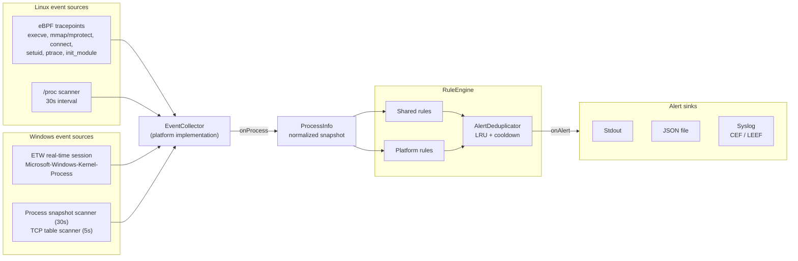
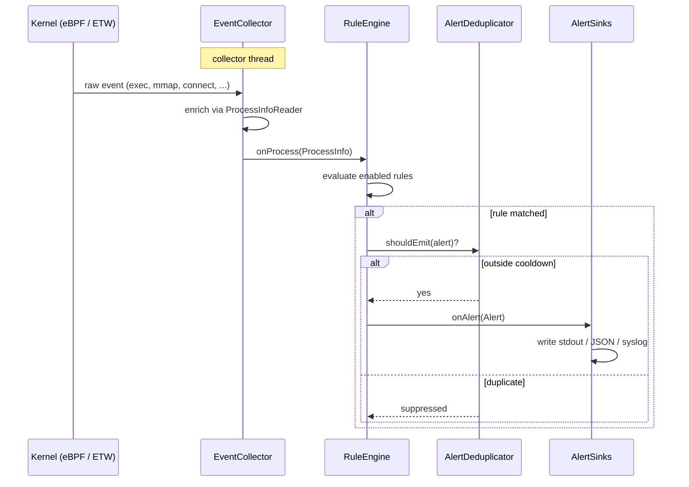

# vigil

`vigil` is a cross-platform Endpoint Detection and Response (EDR) agent written in modern C++23. It collects
process and runtime telemetry directly from the kernel — eBPF tracepoints on Linux, ETW on Windows — normalizes
it into platform-neutral process snapshots, evaluates each snapshot against a configurable set of detection
rules, and emits structured, deduplicated alerts to pluggable output sinks.

Detections cover techniques such as server-spawned shells, execution from writable paths, fileless (memfd)
execution, anonymous RWX mappings, privilege escalation, `LD_PRELOAD` hijacking, binary replacement, ptrace
injection, kernel module loading, LOLBIN abuse, and encoded PowerShell.

The project builds a reusable `vigil_core` library and, by default, the `vigil` executable.

## Architecture

A single pipeline runs on both platforms; only the event sources and the platform rule sets differ.



Key components:

- **`EventCollector`** — abstract event source created via `createEventCollector()`. Each platform
  implementation combines a real-time kernel feed with periodic scans, enriches events through a
  `ProcessInfoReader`, and emits normalized `ProcessInfo` snapshots on its `onProcess` signal.
- **`RuleEngine`** — created via `createRuleEngine(config)`, populated with shared rules plus
  platform-specific rules. Every snapshot is evaluated against all enabled rules; matches produce structured
  `Alert`s carrying key/value attributes and a severity.
- **`AlertDeduplicator`** — thread-safe, bounded LRU cache that suppresses equivalent alerts inside a
  configurable cooldown window, so long-lived processes don't flood the output on every scan.
- **`AlertSink`** — output abstraction behind `createAlertDispatcher(config)`. Sinks are selected in
  `config.json`: stdout, an appending JSON file, or syslog in CEF or LEEF wire format.

### Runtime flow



## Detection rules

Shared rules evaluate a single `ProcessInfo` snapshot and run on both platforms; platform rules use
OS-specific telemetry. All rules are individually configurable (enable/disable, severity, parameters) in
`config.json`.

| Scope | Rule | Detects |
| --- | --- | --- |
| Shared | `ServerSpawnedShellRule` | Shells spawned by server processes (nginx, node, java, ...) |
| Shared | `SuspiciousPathRule` / `ElevatedSuspiciousPathRule` | Execution from writable paths (`/tmp`, `/dev/shm`, ...), with an elevated-privilege variant |
| Shared | `SuspiciousCmdLineRule` | Download-and-execute / reverse-shell command-line patterns |
| Shared | `SuspiciousPortRule` | Connections to known C2/backdoor ports |
| Shared | `FilelessExecutionRule` | Processes executing without a backing file on disk |
| Shared | `AnonRwxRule` | Anonymous RWX memory mappings |
| Shared | `PrivilegeEscalationRule` | Unexpected privilege transitions (with per-path exclusions) |
| Linux | `LdPreloadHijackRule` | `LD_PRELOAD`-based library injection |
| Linux | `BinaryReplacedRule` | Running binaries deleted or replaced on disk |
| Linux | `PtraceInjectRule` | ptrace-based process injection |
| Linux | `KernelModuleLoadRule` | Kernel module loading (`init_module` / `finit_module`) |
| Linux | `DangerousCapabilitiesRule` | Processes holding dangerous capabilities |
| Linux | `ContainerEscapeIndicatorRule` | Container escape indicators |
| Windows | `LolbinExecutionRule` | Living-off-the-land binary abuse |
| Windows | `SuspiciousPowerShellRule` | Encoded / obfuscated PowerShell invocations |
| Windows | `SystemProcessImpersonationRule` | Masquerading as protected system process names |
| Windows | `DebugPrivilegeRule` | Unexpected `SeDebugPrivilege` acquisition |

## Requirements

Common requirements:

- CMake 3.28 or newer
- A C++23 compiler
- Doxygen, optional, for API documentation
- vcpkg manifest mode, or otherwise available CMake packages for:
  - `spdlog`
  - `nlohmann-json`
  - `bext-ut` when `VIGIL_BUILD_TESTS=ON`

Windows requirements:

- Visual Studio 2022 or newer with MSVC C++ tools
- Windows SDK
- System libraries used by the build: `ntdll`, `psapi`, `advapi32`, `iphlpapi`, `ws2_32`

Linux requirements:

- `pkg-config`
- `libbpf`
- `libelf`
- `zlib`
- `clang` with BPF target support
- `bpftool`
- A kernel exposing BTF at `/sys/kernel/btf/vmlinux`
- Permissions/capabilities sufficient to load and run eBPF programs

## Build

Configure and build with CMake:

```sh
cmake -B build \
  -DCMAKE_TOOLCHAIN_FILE=/path/to/vcpkg/scripts/buildsystems/vcpkg.cmake \
  -DVIGIL_BUILD_TESTS=OFF \
  -DVIGIL_BUILD_DOCS=OFF \
  -DVIGIL_ENABLE_INSTALL=OFF
cmake --build build --parallel
```

On Linux, the build generates `src/platform/linux/bpf/vmlinux.h`, compiles `events.bpf.c`, and generates the
BPF skeleton with `bpftool`.

## CMake Options

- `VIGIL_BUILD_APP=ON` builds the `vigil` executable.
- `VIGIL_BUILD_TESTS=ON` builds tests and enables the vcpkg `tests` feature.
- `VIGIL_BUILD_DOCS=ON` enables the Doxygen `docs` target when Doxygen is available.
- `VIGIL_BUILD_EXAMPLES=OFF` builds benign attack-simulation examples for validating rule telemetry.
- `VIGIL_ENABLE_INSTALL=ON` enables install rules for the library, executable, headers, package config files,
  and default config.

## Attack Simulation Examples

The `examples` directory contains C++ programs that generate realistic EDR telemetry for each detection rule
without implementing malware behavior. They model suspicious process trees, execution from writable paths,
memfd/fileless execution, anonymous RWX mappings, privilege boundaries, LD_PRELOAD, ptrace, LOLBIN usage,
encoded PowerShell, protected process-name masquerading, and suspicious-port beacon shapes.

Build them from the main project with:

```sh
cmake -B build -DVIGIL_BUILD_EXAMPLES=ON
cmake --build build --parallel
```

Or build only examples:

```sh
cmake -S examples -B build/examples
cmake --build build/examples --parallel
```

Run examples only in a lab environment while `vigil` is collecting telemetry. Some examples require root,
Administrator, sudo/UAC, or explicit opt-in through `VIGIL_ALLOW_DANGEROUS=1`. See `examples/README.md` for
scenario details and cleanup paths.

## API Documentation

Generate the Doxygen API reference with:

```sh
cmake --build build --target docs
```

The generated HTML entry point is:

```text
build/docs/html/index.html
```

## Usage

The default config is copied from `config/platform/<platform>/config.json` into the application build
directory as `config.json`. Run the built executable:

```sh
./build/app/vigil
```

Stop the agent with `Ctrl+C` or the platform's normal console close/termination signal.

For production-like collection, start the agent with elevated privileges: Administrator on Windows for ETW,
and root or equivalent capabilities on Linux for eBPF.
